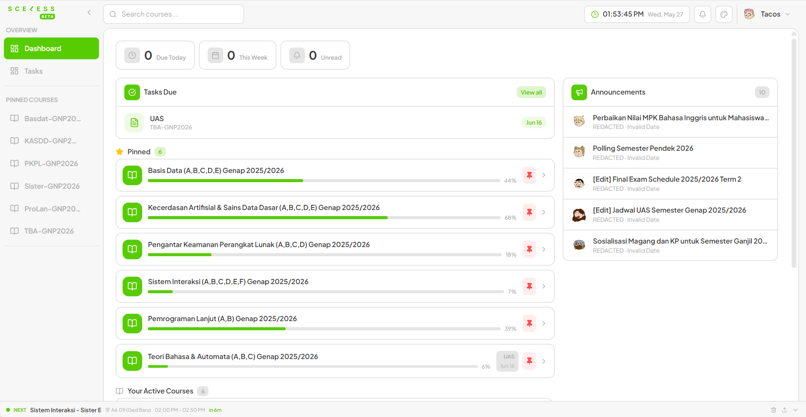
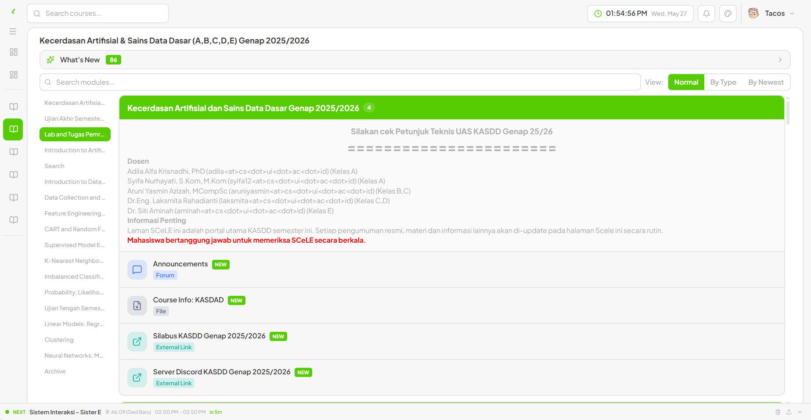
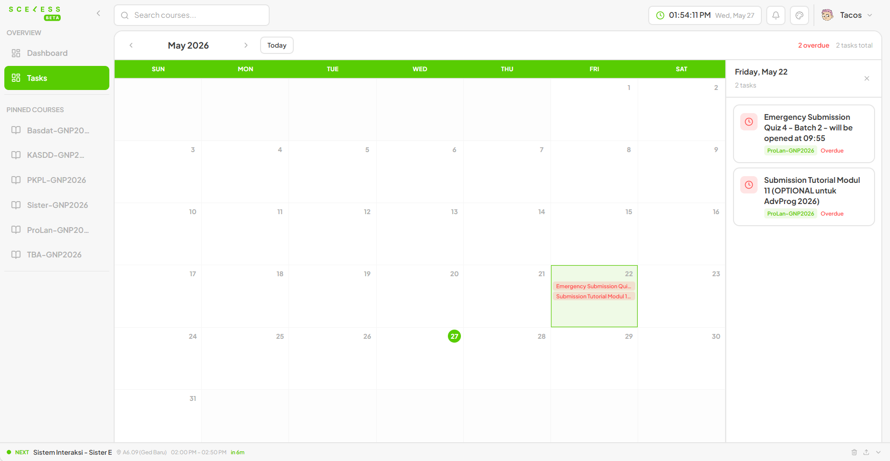
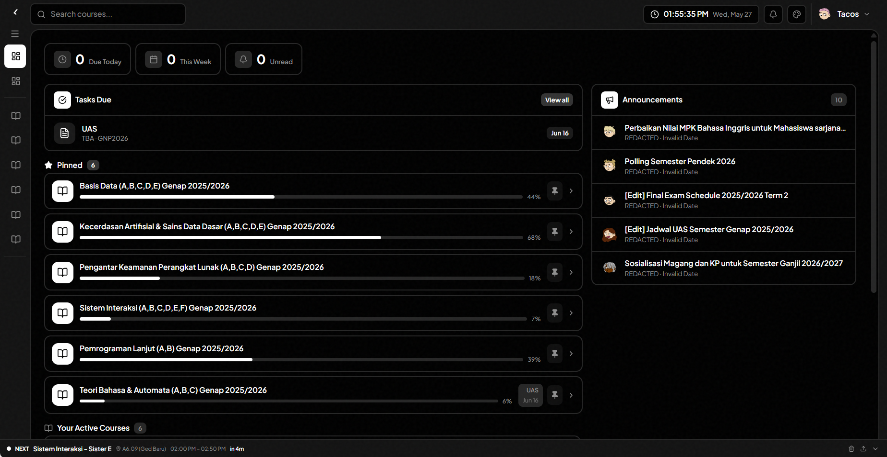
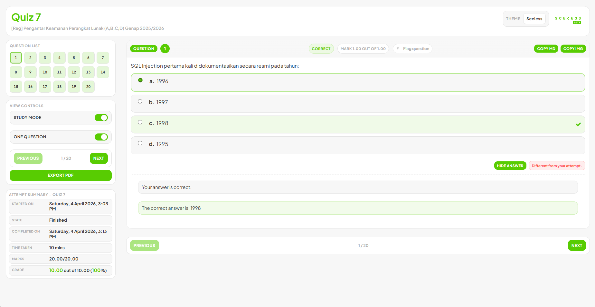

# Sceless

A modern, redesigned UI for [SCELE](https://scele.cs.ui.ac.id) — the Moodle-based LMS of the Faculty of Computer Science, Universitas Indonesia.

> **BETA** — Built for personal use, now available for all UI CS students.

---

## Screenshots

### Dashboard

Overview of upcoming deadlines, pinned courses, academic announcements with inline attachments, and new module highlights.

### Course View

Browse course content by module type or chronologically with a live table of contents. Supports "By Type", "Normal", and "By Newest" grouping modes.

### Tasks Calendar

Google Calendar-style view of all deadlines across every enrolled course. Click any day to see its tasks in the side panel.

### Dark Theme

Multiple built-in themes including dark mode. Switch from the top bar — theme is persisted locally.

### Quiz Review

Fully redesigned quiz review page. Study mode, one-question-at-a-time view, copy as Markdown, copy question image, and PDF export.

---

## Features

| Feature | Description |
|---|---|
| **Dashboard** | Deadlines, pinned courses, announcements, new module highlights |
| **Course view** | Module list with TOC, grouped by type / date / newest |
| **Tasks calendar** | Monthly calendar of all deadlines across courses |
| **Quiz Review** | Redesigned review layout with study mode, PDF export, copy MD/image |
| **Announcements** | Fetches academic announcements with inline attachment links |
| **Theme switcher** | Multiple color themes, dark mode included |
| **Settings** | Toggle features like Quiz Review override |

---

## How It Works

Sceless is a Chrome extension (Manifest V3) built with [WXT](https://wxt.dev), [Preact](https://preactjs.com), and Tailwind CSS v4.

### Content Script Architecture

The extension registers content scripts against `*://scele.cs.ui.ac.id/*`. On page load it:

1. Halts the original page (`window.stop()`)
2. Clears the DOM and injects a single `<div id="sceless-root">`
3. Injects compiled Tailwind CSS inline
4. Mounts the Preact app

This gives Sceless full control of the page while staying within the same origin — no iframes, no redirects.

The **Quiz Review** page (`/mod/quiz/review.php`) has its own dedicated content script that parses the original Moodle DOM before replacement, extracting question data, answer states, and feedback into a typed payload that the review UI consumes.

### Moodle Web Services API

All data is fetched via the official [Moodle Web Services REST API](https://docs.moodle.org/dev/Web_service_API_functions) — the same API used by the official Moodle mobile app. Authentication uses the `moodle_mobile_app` service token, obtained once at login and stored locally in `chrome.storage.local`.

Functions used:

| WS Function | Purpose |
|---|---|
| `core_course_get_enrolled_courses_by_timeline_classification` | Enrolled courses |
| `core_course_get_contents` | Course modules and sections |
| `mod_assign_get_assignments` + `mod_assign_get_submissions` | Deadlines |
| `core_calendar_get_action_events_by_courses` | Calendar events |
| `mod_forum_get_forum_discussions` | Announcements |
| `message_popup_get_popup_notifications` | Notifications |
| `core_webservice_get_site_info` | User profile and site metadata |

### Request Queue

To avoid hammering the SCELE server (especially when loading content for many courses), all Moodle API calls go through a `RequestQueue` that limits concurrency to **5 parallel requests** with a **50ms delay between batches**. This prevents rate-limit errors and keeps the extension well-behaved on shared infrastructure.

```
fetchMoodle("...") → RequestQueue (max 5 concurrent, 50ms delay) → POST /webservice/rest/server.php
```

### Caching (IndexedDB)

Fetched data is cached in IndexedDB with per-key TTLs to avoid redundant API calls on navigation:

| Data | TTL |
|---|---|
| Courses | 1 hour |
| Course contents | 1 hour |
| Deadlines | 30 minutes |
| Announcements | 30 minutes |
| Notifications | 5 minutes |
| Site info | 24 hours |

The first load of each session always fetches fresh data. Subsequent navigations within the same session serve from cache if valid.

---

## Tech Stack

| Layer | Technology |
|---|---|
| Extension framework | [WXT](https://wxt.dev) (Manifest V3) |
| UI | [Preact](https://preactjs.com) + [@preact/signals](https://github.com/preactjs/signals) |
| Styling | [Tailwind CSS v4](https://tailwindcss.com) |
| Icons | [Lucide](https://lucide.dev) |
| Build | Vite |
| Language | TypeScript |

---

## Development

```bash
pnpm install
pnpm dev          # Chrome
pnpm dev:firefox  # Firefox
```

```bash
pnpm build        # Production build
pnpm zip          # Build + package as .zip for store submission
```

Requires a valid SCELE account at `scele.cs.ui.ac.id` to use.

---

## Privacy

Sceless stores data **locally on your device only**. No data is sent to any server other than `scele.cs.ui.ac.id`. Your password is never stored — only the Moodle Web Service token is kept. See [PRIVACY.md](PRIVACY.md) for the full policy.

---

## Disclaimer

Sceless is an independent project and is not affiliated with, endorsed by, or officially connected to Universitas Indonesia or the SCELE platform. Provided as-is, without warranty of any kind.
